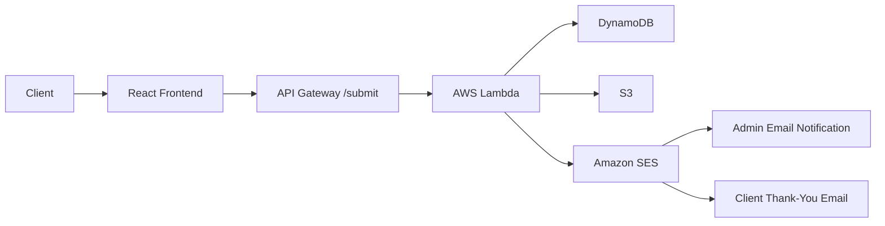
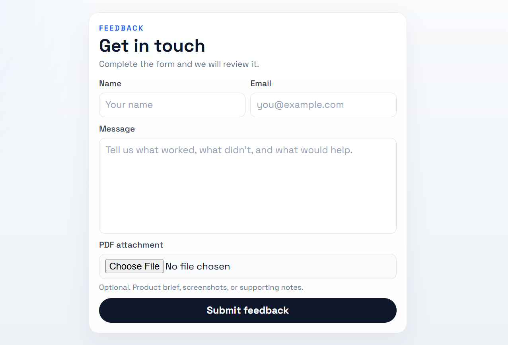
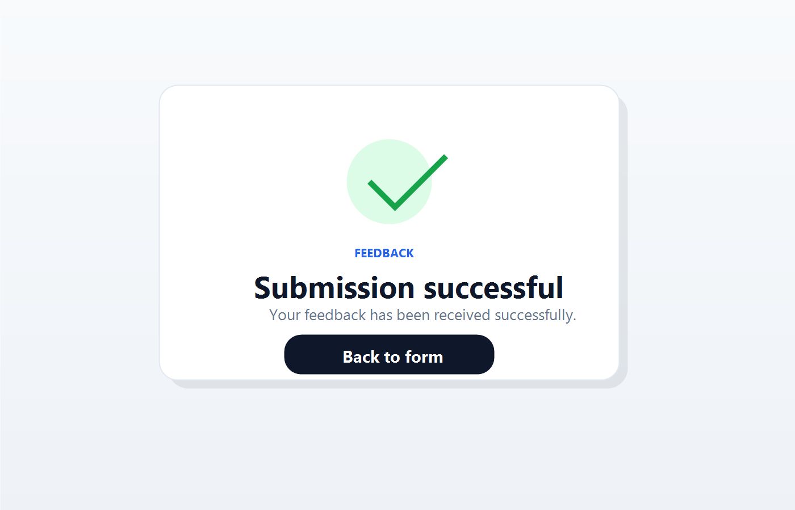
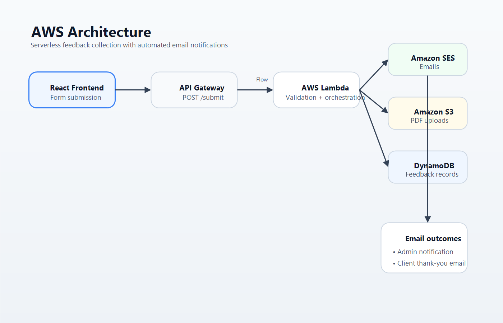

# Serverless Feedback Form

A portfolio project that demonstrates how to build a modern feedback workflow with a React frontend and a serverless AWS backend.

Users can submit feedback through a responsive form, optionally attach a PDF, and trigger two email flows:
- an admin notification email for internal review
- a thank-you email to the client who submitted the feedback

## Project Summary

This project shows how to connect a polished frontend experience to a lightweight backend using AWS managed services. The goal is to collect feedback efficiently, store it securely, and automate follow-up without running or maintaining a traditional server.

[Live Demo](https://shivampisal.github.io/Serverless-Feedback-Form/)

## What It Does

- collects feedback with name, email, and message
- supports optional PDF attachment uploads
- stores feedback records in DynamoDB
- uploads PDF files to S3
- generates a presigned file URL for admin review
- sends a notification email to the admin
- sends a thank-you confirmation email to the client
- supports local development and deployment with AWS SAM

## Tech Stack

### Frontend

- React
- Vite
- CSS

### Backend

- AWS Lambda with Node.js 20
- AWS SDK for JavaScript v3
- Amazon API Gateway
- Amazon DynamoDB
- Amazon S3
- Amazon SES
- AWS SAM

## Architecture



## Key Backend Flow

1. A user submits feedback from the frontend.
2. API Gateway forwards the request to Lambda.
3. Lambda validates the request body and optional PDF.
4. The PDF is uploaded to S3 if included.
5. Feedback metadata is stored in DynamoDB.
6. SES sends an admin notification email.
7. SES sends a thank-you email to the client.

## Project Structure

```text
.
|-- frontend/
|   |-- src/
|   |-- .env.example
|   |-- index.html
|   |-- package.json
|   `-- vite.config.js
|-- lambda/
|   |-- package.json
|   `-- submitFeedback.js
|-- template.yaml
`-- .github/
    `-- workflows/
        `-- deploy.yml
```

## Local Development

### Frontend

```bash
cd frontend
npm install
npm run dev
```

Set the API URL in `frontend/.env`:

```env
VITE_FEEDBACK_API_URL=http://127.0.0.1:3000/submit
```

### Backend

```bash
cd lambda
npm install
cd ..
sam build
sam local start-api
```

Local API endpoint:

```text
http://127.0.0.1:3000/submit
```

## Deployment

The backend can be deployed with AWS SAM:

```bash
sam build
sam deploy --guided
```

After deployment:

1. copy the `SubmitEndpoint` output
2. add it to `frontend/.env` as `VITE_FEEDBACK_API_URL`
3. build the frontend with `npm run build`
4. upload `frontend/dist` to your hosting target such as S3 or CloudFront

## GitHub Showcase

If you want to showcase the project without deploying the full AWS backend, you can:

- push the repository to GitHub
- publish the frontend with GitHub Pages
- keep the backend documented in the README as the AWS architecture portion of the project

The included GitHub Actions workflow builds the React frontend and deploys it to GitHub Pages on pushes to `main`.

To use that workflow:

1. create a GitHub repository and push this code
2. open repository settings and enable GitHub Pages with `GitHub Actions` as the source
3. optionally add the repository secret `VITE_FEEDBACK_API_URL` if you want the live frontend connected to a real backend
4. push to `main`

If `VITE_FEEDBACK_API_URL` is not provided, the frontend runs in demo mode on GitHub Pages and shows the submission experience without sending data to a backend.

## AWS Resources Used

- Lambda for backend execution
- API Gateway for the public API
- DynamoDB for feedback storage
- S3 for PDF uploads
- SES for email notifications

## Portfolio Highlights

- built a full-stack feedback workflow using React and AWS serverless services
- designed a responsive frontend with a clean submission experience
- implemented backend validation for user input and PDF uploads
- added dual email handling for internal admin alerts and client confirmations
- used SAM to support local development and repeatable cloud deployment

## Screenshots

### Feedback Form



### Submission Success



### AWS Architecture



## Short Description For GitHub

Serverless feedback collection app built with React, Node.js, Lambda, API Gateway, DynamoDB, S3, SES, and AWS SAM.

## Short Description For LinkedIn Or Resume

Built a serverless feedback platform with React and AWS that captures user feedback, stores submissions in DynamoDB, uploads PDF attachments to S3, and automates both admin alerts and customer confirmation emails through SES.

## Notes

- SES must be verified and ideally moved to production access for public email sending
- frontend hosting is separate from SAM backend deployment
- this project works well as a portfolio piece even without a full live AWS deployment, as long as the code, architecture, and screenshots are documented clearly
